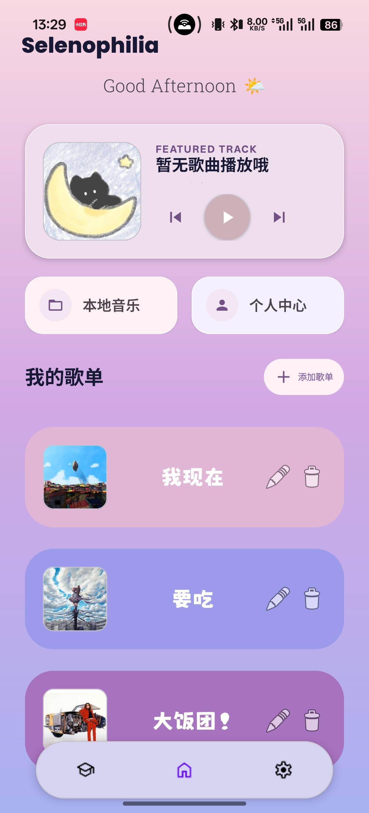
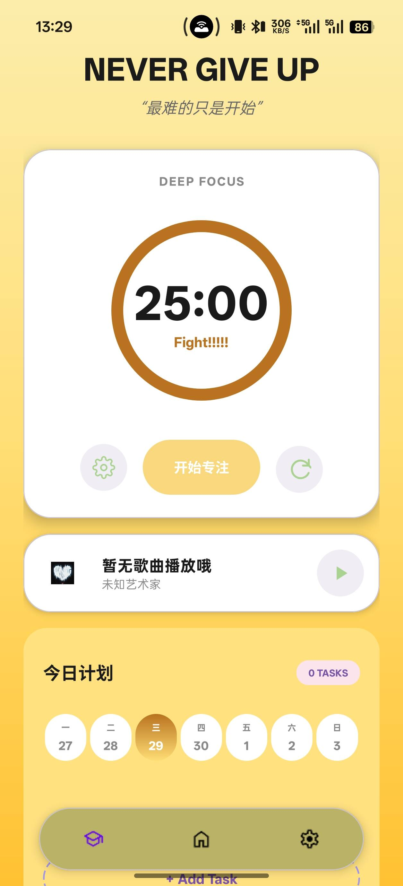
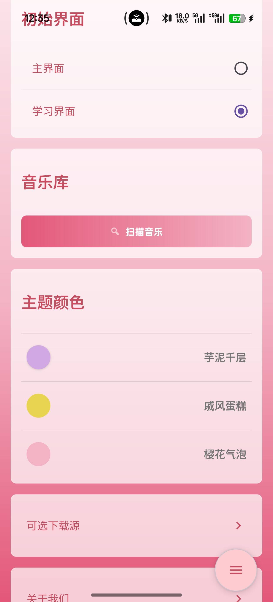

# Selenophilia (TMusic) 🌙🎵

|  |  |  |
| :---: | :---: | :---: |

**Selenophilia** 是一款将“本地音乐播放”与“专注效率”巧妙结合的现代 Android 应用。我们致力于为您提供一个纯粹、无打扰的听歌环境，同时帮助您在音乐的陪伴下更好地进入学习和工作的心流状态。

## ✨ 核心功能亮点

### 🎵 纯粹的音乐播放体验
- **智能本地扫描**：自动识别设备中的音频文件，精准解析封面、歌手与时长信息。
- **沉浸式播放页**：精心设计的播放界面，支持动态封面展示与丝滑的进度调节。
- **锁屏与后台播放**：支持系统级锁屏控制，应用退到后台音乐依然流畅陪伴。
- **全能播放控制**：列表循环、单曲循环、随机播放随心切换。

### 📁 自由的歌单管理
- **定制专属歌单**：轻松创建你的私人音乐合集，支持随时添加、移除本地音乐。
- **智能动态封面**：歌单封面会自动抓取最新添加歌曲的专辑图，时刻保持新鲜感。
- **快速检索与排序**：支持对歌单内的歌曲进行名称、时间、歌手等多维度排序和快捷搜索。

### 🍅 音乐与专注的完美结合
- **番茄专注计时**：内置番茄钟（支持正计时/倒计时），在背景音乐中助你快速进入深度专注（心流）状态。
- **每日任务清单**：轻量级的待办打卡（PlanList），随时添加、勾选和规划每天的专注任务。
- **日程时间轴**：通过直观的日期选择视图，轻松回顾或规划一周的任务安排。

### 🎨 懂你的个性化设置
- **百变主题色**：内置多种主题色彩，一键无缝切换，满足你的个性偏好。
- **自定义首屏**：启动 App 是想先听歌还是先专注？你可以在设置中自由选择默认的首屏页面（主页或专注模式）。
- **优秀的视觉体验**：经过精心打磨的 UI 设计，完美适配各类 Android 手机的屏幕尺寸。

---

*“在音乐中寻找宁静，在专注中遇见更好的自己。”*
